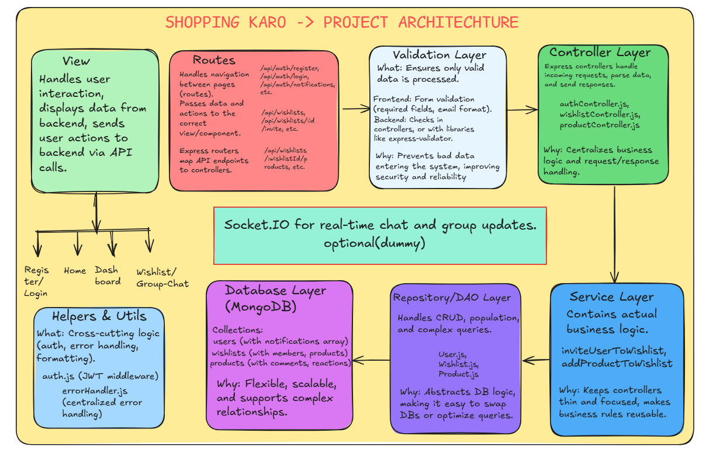

# ShoppingKaro - Collaborative Wishlist Platform

**Author:** [Your Name Here]

A modern, collaborative platform where multiple users can create, manage, and interact with wishlists in real-time—perfect for group shopping sprees, event planning, or shared gift lists. ShoppingKaro enables users to invite friends, add products, comment, react, and receive notifications, all in a beautiful, responsive UI.

---

## What Does This App Do?
- **Collaborative Wishlists:** Create and manage wishlists for any occasion, and invite others to join and contribute.
- **Group Shopping:** Plan group purchases, events, or shared gift lists with real-time collaboration.
- **Product Management:** Add, edit, and comment on products in any wishlist.
- **Notifications:** Receive and view notifications for invites and group activity.
- **Chat (Dummy):** Each group has a chat box for discussion (can be upgraded to real-time).
- **Authentication:** Secure login/register with JWT.
- **Responsive Design:** Works on desktop and mobile.

---

## Modification Details
- **Modular MVC Architecture:** Clean separation of view, service, routing, controller, service, repository, and DB layers.
- **Real-Time Ready:** Socket.IO structure in place for future real-time chat and updates.
- **Notifications System:** Users receive and view notifications for invites and group activity.
- **User Picker:** Search and filter users when inviting to a group.
- **Personalized Navbar:** Shows greeting with username when authenticated.
- **Robust Error Handling:** User-friendly error messages and validation throughout.
- **Vite Proxy:** Ensures smooth frontend-backend API communication in development.
- **Database Relationships:** All group membership, product, and notification data is tracked and queryable in MongoDB.
- **Clean UI/UX:** Modern, responsive design with Tailwind CSS.

---

## Tech Stack Used
- **Frontend:** React, Tailwind CSS, Vite
- **Backend:** Node.js, Express
- **Database:** MongoDB (via MongoDB Atlas)
- **Authentication:** JWT (simple/dummy auth)
- **Deployment:** Vercel/Netlify (frontend), Render/Railway (backend), MongoDB Atlas (database)

---

## Architecture



**System Design Overview:**
- **View Layer (Frontend):** React components for all UI, connected to React Router for navigation.
- **Service/API Layer (Frontend):** Centralized API service (Axios) for all HTTP requests to backend.
- **Routing Layer (Backend):** Express routers map API endpoints to controllers (e.g., `/api/auth/register`, `/api/wishlists/:id/invite`).
- **Validation Layer:** Both frontend and backend validate data before processing.
- **Controller Layer:** Handles request/response, calls service/business logic.
- **Service Layer:** (If present) Contains business rules, orchestrates repository calls.
- **Repository/DAO Layer:** Mongoose models and (optionally) custom DAOs for all DB access.
- **Database Layer:** MongoDB collections for users, wishlists, products, with clear schemas and relationships.
- **Helpers/Utils:** Auth, error handling, and reusable logic.
- **Real-Time Layer:** (Optional) Socket.IO for live chat and updates.

**Key Flows:**
- User actions in the View are routed and validated, then handled by controllers, which call services and repositories to update/query the database. Responses and notifications are sent back through the same layers.

---

## Setup Instructions

### Prerequisites
- Node.js (v16+ recommended)
- npm or yarn
- MongoDB Atlas account (or local MongoDB)

### 1. Clone the Repository
```bash
git clone <your-repo-url>
cd shoppingkaro
```

### 2. Setup the Backend
```bash
cd backend
cp .env.example .env # Create your .env file
npm install
```

#### Example `.env` for Backend
```
PORT=5000
MONGO_URI=mongodb+srv://<username>:<password>@cluster.mongodb.net/wishlist-app?retryWrites=true&w=majority
JWT_SECRET=your_jwt_secret
```

#### Run the Backend
```bash
npm start
# or
node server.js
```

### 3. Setup the Frontend
```bash
cd ../frontend
cp .env.example .env # (if needed)
npm install
```

#### Example `.env` for Frontend (if using Vite proxy, usually not needed)
```
VITE_API_URL=http://localhost:5000/api
```

#### Run the Frontend
```bash
npm run dev
```

### 4. Open the App
- Frontend: [http://localhost:5173](http://localhost:5173)
- Backend: [http://localhost:5000](http://localhost:5000)

---

## Assumptions or Limitations
- **Authentication is simple/dummy:** No email verification or password reset. JWT is used for session management.
- **Invite feature is mocked:** Inviting users to a wishlist only updates the UI and does not send real invitations.
- **No real-time sync:** Changes are not instantly reflected for all users unless the page is refreshed. (No WebSocket/Firebase integration yet.)
- **No file/image uploads:** Product images are referenced by URL only.
- **No payment or checkout:** The app is for wishlist management, not actual purchases.
- **Mobile responsiveness:** The UI is responsive, but some advanced mobile features (like PWA/offline) are not implemented.
- **Deployment:** Example deployment instructions are provided, but you must set up your own hosting and environment variables.

---

## Features
- User authentication (register/login)
- Create, update, delete wishlists
- Add, edit, delete products in wishlists
- Invite users to wishlists (mocked)
- See who added/edited each product
- Comments and emoji reactions on products
- Responsive design for mobile and desktop

## License
MIT

---
Feel free to contribute or open issues for improvements! 